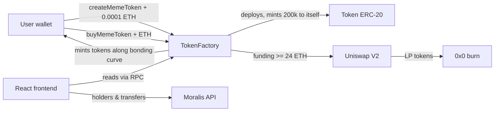

# pump.fun clone — built with Moralis

A full-stack memecoin launchpad inspired by [pump.fun](https://pump.fun). Anyone can launch an ERC-20 memecoin for a small fee, and buyers get tokens priced along an **exponential bonding curve**. When a token raises **24 ETH**, the contract adds its liquidity to **Uniswap V2** and burns the LP tokens, so the liquidity can never be pulled.

The smart contracts are written in Solidity with Hardhat. The frontend uses React and ethers.js. On-chain data such as token holders and transfer history comes from the [Moralis Web3 Data API](https://moralis.io).

<p align="left">
  
  
  
  
  
  
</p>

---

## Features

- **One-click token launch.** Deploy a new ERC-20 with a name, ticker, description, and image for a 0.0001 ETH fee.
- **Bonding-curve pricing.** The price rises exponentially with supply. The math runs on-chain using a Taylor-series approximation of `eˣ`.
- **Automatic Uniswap listing.** When a token's funding goal is reached, the contract creates a Uniswap V2 pair, adds liquidity, and burns the LP tokens.
- **Token explorer.** Browse every launched token, track bonding-curve progress, and see how much supply is left.
- **Holders and transfers.** Each token page lists its holders and transfer history, loaded from the Moralis API.
- **Wallet support.** Create and buy tokens with MetaMask or any other EIP-1193 browser wallet.

## How it works



| Parameter            | Value                                   |
| -------------------- | --------------------------------------- |
| Creation fee         | `0.0001 ETH`                            |
| Max supply           | `1,000,000` tokens                      |
| Initial mint         | `200,000` tokens (reserved for the LP)  |
| Sold on the curve    | `800,000` tokens                        |
| Funding goal         | `24 ETH`                                |
| Initial price (`P0`) | `0.00003 ETH`                           |

The cost of buying `n` tokens when `s` tokens have already been sold is:

```
cost = (P0 / k) · (e^(k·(s + n)) − e^(k·s))
```

## Tech stack

| Layer          | Tools                                                     |
| -------------- | --------------------------------------------------------- |
| Smart contracts | Solidity 0.8.24, Hardhat, OpenZeppelin ERC-20, Uniswap V2 |
| Frontend       | React 18, React Router 6, ethers.js v6                    |
| Data           | Moralis Web3 Data API, Moralis RPC nodes                  |

## Project structure

```
.
├── hardhat/                  # Smart contracts
│   ├── contracts/
│   │   ├── TokenFactory.sol  # Launchpad, bonding curve, Uniswap listing
│   │   └── Token.sol         # ERC-20 minted by the factory
│   ├── ignition/modules/     # Deployment module
│   ├── test/                 # Contract tests (run on a mainnet fork)
│   └── hardhat.config.js
└── frontend/                 # React app
    └── src/components/
        ├── Home.jsx          # Token list
        ├── TokenCreate.jsx   # Launch a new token
        ├── TokenDetail.jsx   # Curve progress, buy, holders, transfers
        ├── abi.js            # TokenFactory ABI
        └── tokenAbi.js       # ERC-20 ABI
```

## Getting started

### Prerequisites

- Node.js 18 or later
- A [Moralis](https://admin.moralis.io/register) account (free tier works), for an API key and RPC node URLs
- MetaMask or another browser wallet funded with Sepolia ETH

### 1. Clone

```bash
git clone https://github.com/bharathbabu3017/pump-fun-clone-moralis.git
cd pump-fun-clone-moralis
```

### 2. Smart contracts

```bash
cd hardhat
npm install
cp .env.example .env      # fill in your RPC URLs and deployer key
npm run compile
npm test                  # runs against a local fork of Ethereum mainnet
```

Deploy `TokenFactory` to Sepolia:

```bash
npm run deploy:sepolia
```

Copy the deployed contract address. The frontend needs it in the next step.

See [`hardhat/README.md`](hardhat/README.md) for more details.

### 3. Frontend

```bash
cd ../frontend
npm install
cp .env.example .env      # fill in the contract address, RPC URL, and Moralis API key
npm start
```

Open [http://localhost:3000](http://localhost:3000).

| Variable                     | Description                                    |
| ---------------------------- | ---------------------------------------------- |
| `REACT_APP_CONTRACT_ADDRESS` | Deployed `TokenFactory` address                |
| `REACT_APP_RPC_URL`          | Sepolia RPC URL, for example from Moralis nodes |
| `REACT_APP_X_API_KEY`        | Moralis Web3 Data API key                      |

> **Note:** Create React App bundles every `REACT_APP_*` variable into the client JavaScript, so anyone using the app can see your Moralis API key. That's fine for local development. For a public deployment, send the Moralis requests through a small backend instead.

## Disclaimer

This is an educational project. **The contracts have not been audited** and should not be used with real funds. The Uniswap V2 router and factory addresses in `TokenFactory.sol` are the Ethereum mainnet deployments.

## License

[MIT](LICENSE)
